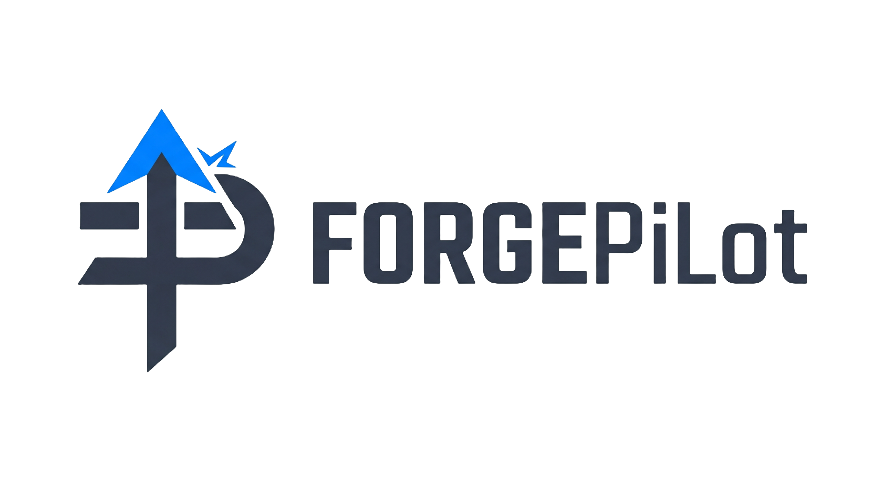
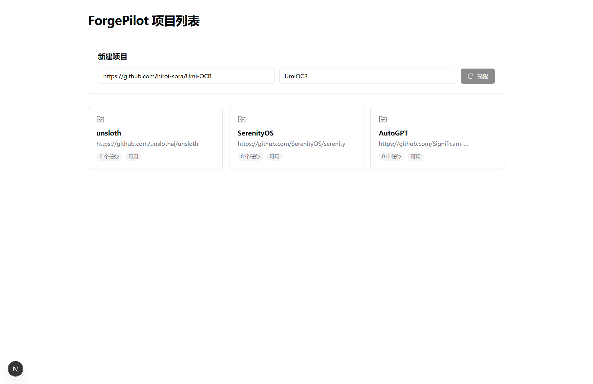
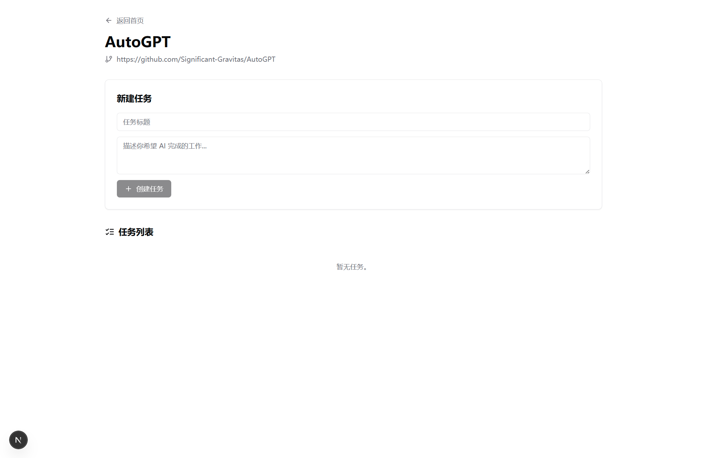
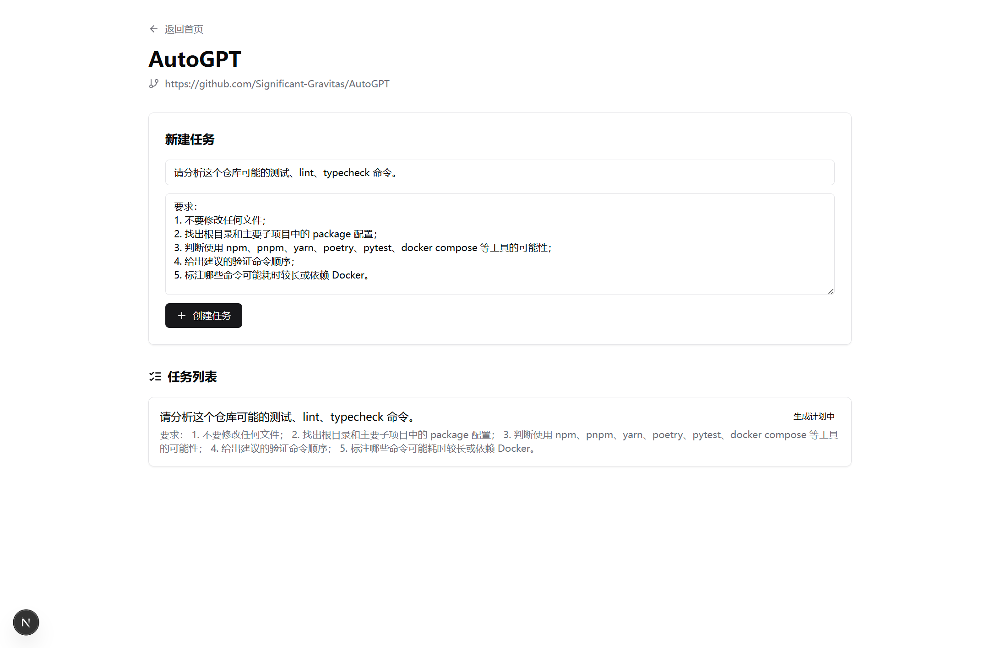
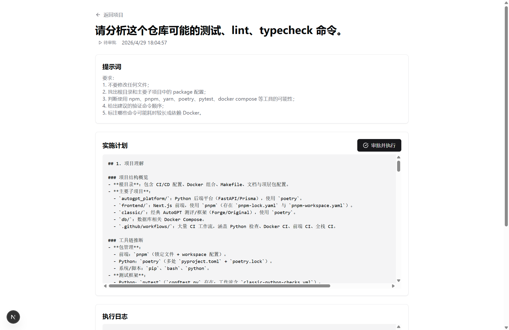
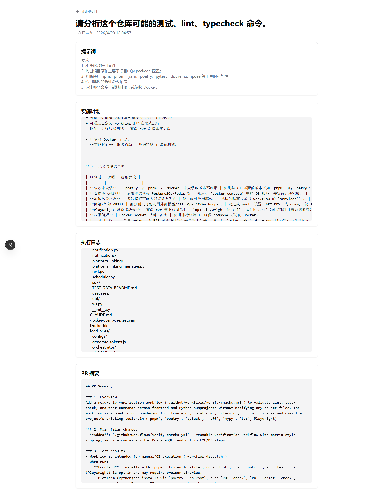

<p align="center">
  
</p>

# ForgePilot

ForgePilot 是一个基于 Next.js + Prisma + SQLite 的 AI 开发工作流 Agent（MVP 版本）。面向开发团队，支持克隆 GitHub 仓库、分析项目结构、生成执行计划、审批后写入代码变更、运行验证命令、失败后最多自动修复 3 次，并输出 PR 摘要。

## 技术栈

- **前端**：Next.js 15（App Router）、React 19、TypeScript、Tailwind CSS
- **后端**：tRPC、Next.js Route Handlers
- **数据库**：SQLite + Prisma
- **Git**：simple-git
- **模型**：OpenAI 兼容接口，支持 Xiaomi MiMo、OpenAI、DeepSeek、OpenRouter
- **代码质量**：TypeScript、ESLint、Prettier

## 快速开始

```bash
npm install
# Windows：copy .env.example .env
# macOS / Linux：cp .env.example .env
npx prisma migrate dev
npm run dev
```

访问 http://localhost:3000

## 运行截图

### 项目列表



### 创建任务





### 执行任务





## 模型配置

在 `.env` 中至少配置一个提供商的 API Key。

### Xiaomi MiMo

```env
MIMO_API_KEY=your-mimo-api-key
MIMO_BASE_URL=https://your-mimo-compatible-base-url/v1
MIMO_MODEL=your-mimo-model
```

### OpenAI

```env
OPENAI_API_KEY=sk-...
OPENAI_BASE_URL=https://api.openai.com/v1
OPENAI_MODEL=gpt-4o
```

### DeepSeek

```env
DEEPSEEK_API_KEY=sk-...
DEEPSEEK_BASE_URL=https://api.deepseek.com
DEEPSEEK_MODEL=deepseek-chat
```

### OpenRouter

```env
OPENROUTER_API_KEY=sk-or-v1-...
OPENROUTER_BASE_URL=https://openrouter.ai/api/v1
OPENROUTER_MODEL=openrouter/auto
```

## API 接口

前端通过 tRPC 调用 `/api/trpc`，同时提供 REST 风格的兼容接口：

- `POST /api/projects` 参数：`{ "repoUrl": "...", "name": "..." }`
- `GET /api/projects`
- `GET /api/projects/:id`
- `POST /api/tasks` 参数：`{ "projectId": "...", "title": "...", "prompt": "..." }`
- `GET /api/tasks/:id`
- `POST /api/tasks/:id/approve`
- `POST /api/tasks/:id/run`

## MVP 功能清单

| 功能模块                        | 状态   |
| ------------------------------- | ------ |
| 项目初始化                      | 已完成 |
| Prisma 数据模型、迁移、SQLite   | 已完成 |
| GitHub 仓库克隆到 `./workspace` | 已完成 |
| 仓库文件树分析                  | 已完成 |
| OpenAI 兼容模型提供商           | 已完成 |
| Anthropic 提供商骨架            | 已预留 |
| 任务创建与计划生成              | 已完成 |
| 计划审批与执行                  | 已完成 |
| 写入文件前记录 diff 日志        | 已完成 |
| 自动检测验证命令                | 已完成 |
| 失败自动修复（最多 3 次）       | 已完成 |
| PR 摘要生成                     | 已完成 |
| tRPC API                        | 已完成 |
| REST API 处理器                 | 已完成 |
| 前端项目/任务界面               | 已完成 |
| ESLint 与 Prettier 配置         | 已完成 |

## 安全边界

- 所有仓库均克隆到 `./workspace` 目录下。
- 项目路径严格校验，禁止访问 `./workspace` 以外的目录。
- Agent 文件写入仅限克隆的项目内部。
- 禁止读写 `.env`、密钥文件、凭证文件、`.git`、`.ssh` 以及包管理器 lock 文件。
- 验证命令仅从白名单脚本（test / lint / typecheck）中生成。
- 危险命令模式（如 `rm -rf /`、`sudo`、`curl | bash`、`chmod 777 /`）会被拦截。
- 每个关键 Agent 步骤均持久化到 `AgentRunLog` 表。

## 代码校验

```bash
npm run typecheck
npm run lint
npm run build
npx prisma validate
npx prisma migrate status
```

## 使用示例

1. 在首页通过 GitHub 链接创建一个新项目。
2. 进入项目详情页。
3. 创建任务，例如「为 parser 模块添加单元测试」。
4. 等待状态变为 `awaiting_approval`（待审批）。
5. 打开任务详情并点击「审批并执行」。
6. 查看执行日志、验证输出和最终生成的 PR 摘要。

## 待办事项

- 所有任务完成后都会生成 PR Summary，但对于“只读分析任务”，用户真正需要的是结构化分析报告，而不是 PR 摘要。
- 用持久化队列替代进程内 `setTimeout` 后台任务。
- 增加 SSE 或 WebSocket 实时日志推送。
- 接入真实的 Anthropic SDK 实现。
- 在审批前增加可视化代码 diff 预览。
- 增加身份认证和团队权限管理。
- 支持按项目自定义验证命令。
